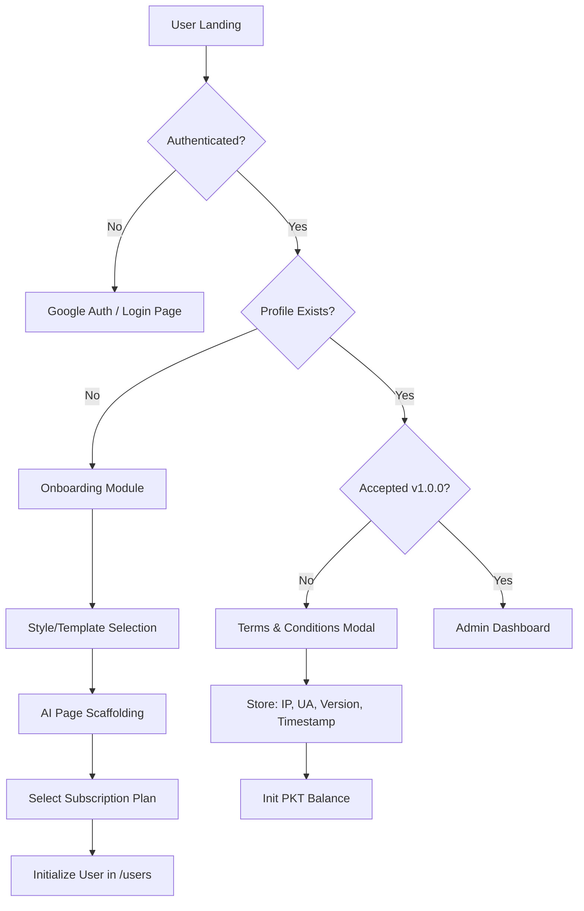
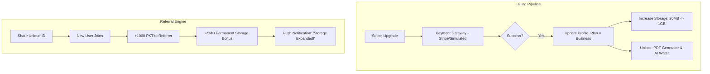
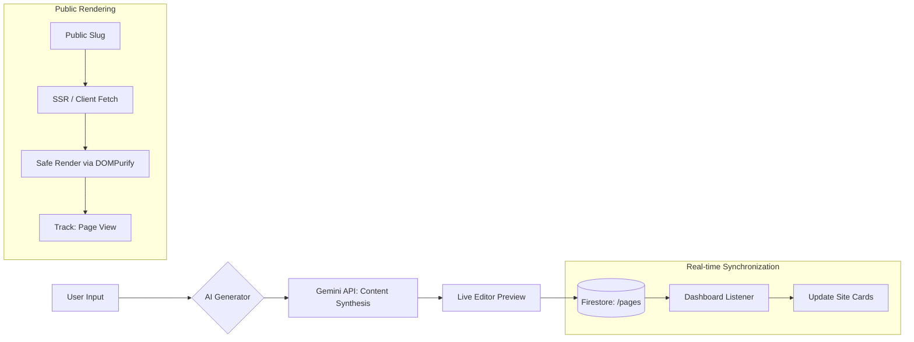
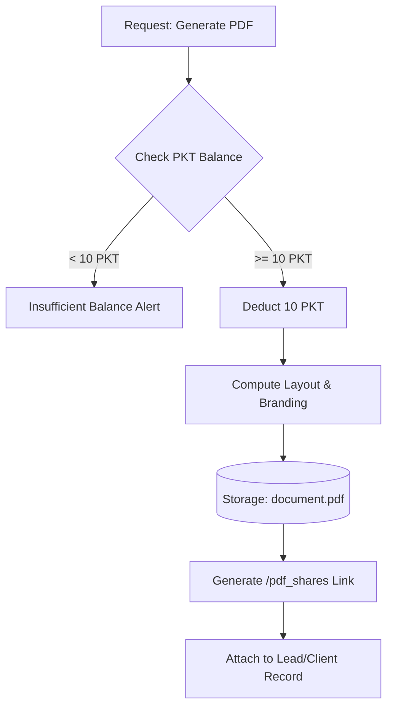
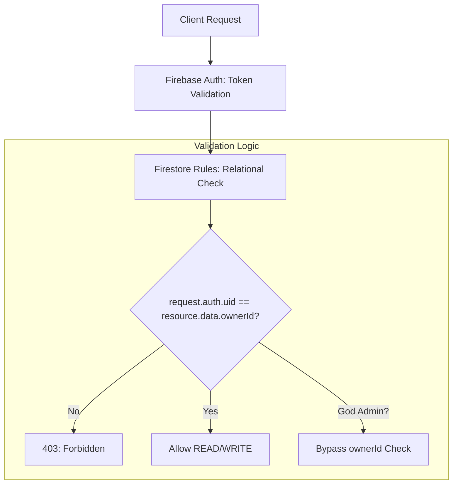
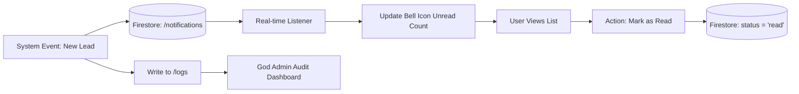
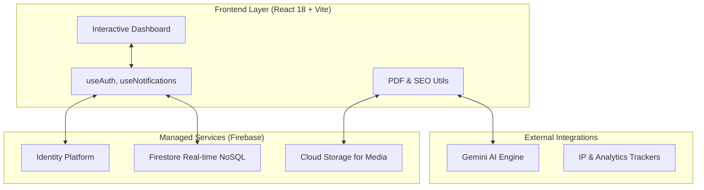

# VGOT Digital Experiences: Full SaaS Architecture Blueprint

This document represents the complete technical and logic circuit for the VGOT platform, covering all aspects from user acquisition to God-level administration.

## 1. The Gateway & Legal Protocol (Onboarding Flow)

## 2. Monetization & Growth Loop

## 3. The Content & AI Synthesis Engine

## 4. PKT Point Economy & PDF Suite

## 5. Security Architecture & Data Isolation

## 6. Real-time Notification & Audit System

## 7. Edge Cases & Error Handling
| Trigger | Action | Outcome |
| :--- | :--- | :--- |
| **Quota Full** | Check bytes on upload | Disable 'Upload' button; Show 'Storage Full' Toast |
| **Auth Expiry** | Listener detects null user | Clear LocalState; Redirect to /login |
| **Invalid Slug** | Query returns empty | Render 404 Custom Branded Page |
| **Rule Violation** | Catch Firebase Error | Log to Console; Show 'Permission Denied' Dialog |

## 8. High-Level Architecture Layer

---
**VGOT Precision SaaS Blueprint**
Status: Verified Modular & Scalable
Last Revision: May 2024
Architecture: Enterprise Edition (Enterprise Tier Firestore)
