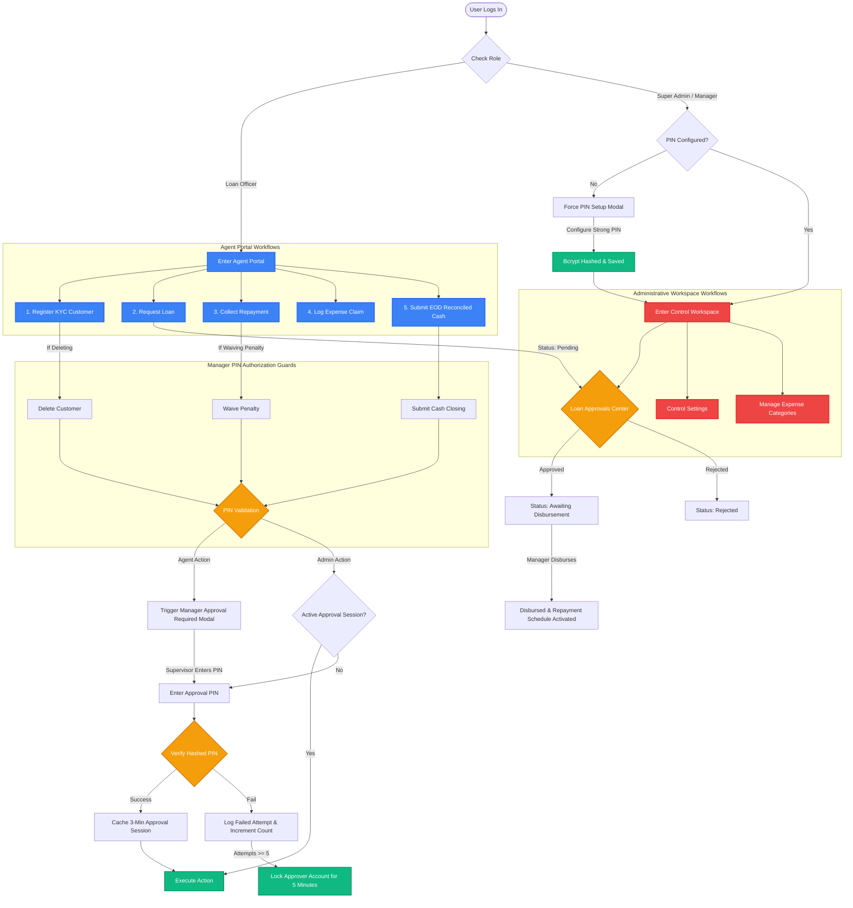

# VGot You Finance — System Workflow Manual

This document provides a comprehensive guide to the role-based workflows, permissions matrix, and transaction lifecycles in the **VGot You Finance Management System (VFMS)**.

---

## 👥 Role Permissions Matrix

| Feature Module | Super Admin | Manager | Auditor | Loan Officer (Agent) |
| :--- | :---: | :---: | :---: | :---: |
| **Dashboard View** | ✅ Full | ✅ Full | 👁 Read-Only | 📱 Mobile Portal |
| **Reports Centre** | ✅ Full | ✅ Full | 👁 Read-Only | ❌ Restricted |
| **Customers Directory** | ✅ Edit / Delete | ✅ Edit / Delete | 👁 Read-Only | 📱 My Customers Only |
| **Loans Ledger** | ✅ Full | ✅ Full | 👁 Read-Only | 📱 Request Only |
| **Loan Approvals** | ✅ Approve/Disburse | ✅ Approve/Disburse | 👁 Read-Only | ❌ Restricted |
| **Daily Collections** | ✅ Full | ✅ Full | 👁 Read-Only | 📱 Log Payments |
| **Expenses Log** | ✅ Approve Claims | ✅ Approve Claims | 👁 Read-Only | 📱 Claim Logging |
| **Expense Categories** | ✅ Manage | ✅ Manage | ❌ Restricted | ❌ Restricted |
| **Cash Closing** | ✅ Authorize | ✅ Authorize | 👁 Read-Only | 📱 Submit closing |
| **Control Settings** | ✅ Full | 🔑 PIN Change Only | 👁 Logs Only | ❌ Restricted |
| **Approval PIN** | 🔑 Owns & Uses | 🔑 Owns & Uses | ❌ None | ❌ None |

---

## ⚙️ Interactive System Workflows



---

## 🔑 Security & Authorization Flow (PIN Guard)

When a Loan Officer triggers a restricted action, the system intercepts the execution and requires a supervisor to authorize it:

### 1. Verification & Verification Session
1. **PIN Required on Actions**: If a restricted action is triggered (e.g., Deleting a customer, waiving daily collection penalties, or initiating cash closing):
   - If a **Super Admin** or **Manager** is logged in, they can authenticate using their own PIN.
   - If a **Loan Officer** is logged in, they are shown a **Manager Approval Required** dialog asking a nearby supervisor to input their PIN.
2. **Session Caching**: When a supervisor successfully enters their PIN, the system starts a **3-minute Approval Session** (duration configurable by Admin). During this time, consecutive actions can be performed without re-entering the PIN.

### 2. Lockout and Security Auditing
- **Brute-Force Lockout**: PIN attempts are validated using secure `bcryptjs` hashing. If an approver account accumulates **5 failed PIN attempts**, that specific account is locked for **5 minutes** (locked until timestamp stored persistently in Firestore).
- **Security Audit logs**: Successful and failed PIN attempts are logged to an immutable security audit database, recording:
  - Timestamp & Action
  - Approver Name & Role
  - Requesting Agent Name & Role
  - Device details, IP Address, and Browser User Agent

---

## 📈 Lending Lifecycle

```
[Agent] Register Customer Profile
       │
       ▼
[Agent] Submit Loan Request (Pending Approval)
       │
       ├─► [Manager/Admin] Reject Loan (Application Terminated)
       │
       ▼
[Manager/Admin] Approve Loan (Status: Approved - Awaiting Disbursement)
       │
       ▼
[Manager/Admin] Disburse Loan (Capital Released, Repayment Schedule Activated)
```

---

## 💰 End-of-Day (EOD) Cash Closing

At the end of each field route, Loan Officers must reconcile and close their cash books:

1. **Reconciliation**: Agent enters cash on hand and accounts for collected payments minus approved field expenses.
2. **Manager Approval**: The agent clicks **Close Cash**, which prompts for a Manager/Admin PIN.
3. **Closing Audit**: The manager enters their PIN, locking the agent's ledger entries for that day to prevent tampering or modification.
